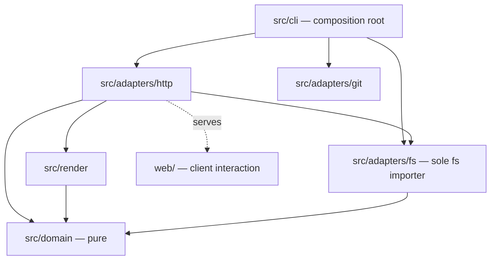
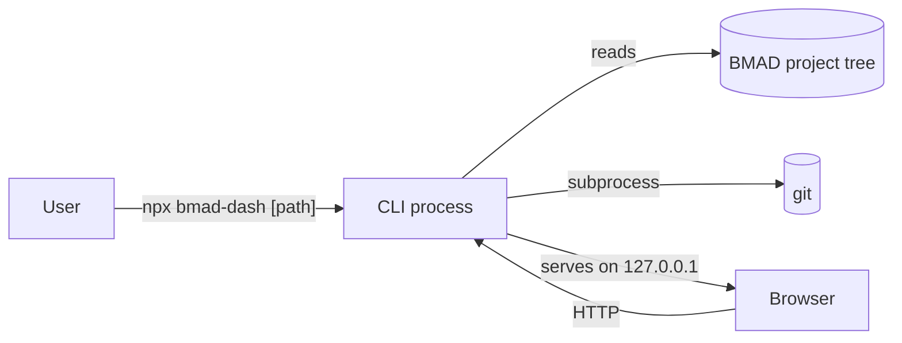

# Architecture Spine — bmad-dash

## Design Paradigm

**Layered — a pure domain with adapters at the edges.** The domain holds the project model and every decision made about it; all I/O lives in adapters, which depend on the domain rather than the reverse. Adapters import the domain directly: there is no ports ring, and none was ever built (see the Amendment log, 2026-09-03).

Chosen for enforceability rather than tidiness: NFR-1 requires read-only to be *verified by test, not convention*, and a one-directional dependency makes that a mechanical assertion — only one directory may import `node:fs`, and the domain may import nothing at all. Both halves are enforced by `test/architecture.test.ts` rather than asserted here. It also leaves identification, normalization, ordering, and sectioning as pure functions over data, which is where this product's correctness actually lives.

| Layer | Directory | May import |
| --- | --- | --- |
| Domain — model, identification, normalization, ordering, sectioning | `src/domain/` | nothing outside `src/domain/` |
| Outbound adapters — filesystem, git, browser | `src/adapters/fs/`, `src/adapters/git/`, `src/adapters/browser/` | domain types, Node built-ins |
| Inbound adapter — HTTP | `src/adapters/http/` | domain, render, and the path vocabulary (`CanonicalPath`, `toPlatform`) from `src/adapters/fs/paths.ts` |
| Render — server-side HTML from the domain model | `src/render/` | domain types only |
| Composition root — CLI entry, wiring | `src/cli/` | everything |
| Client interaction — built, shipped prebuilt | `web/` → `public/` | nothing from `src/` |

## Invariants & Rules



Arrows are the permitted direction of dependency. `src/domain/` has no outgoing arrow and must acquire none.

`HTTP --> FS` is the narrowest edge here and the only one qualified in the table: the HTTP adapter takes the `CanonicalPath` brand and `toPlatform` (which is `return path`, an unbrand) so its `projectRoot` cannot be an arbitrary string. It reaches nothing that reads or resolves, and `test/architecture.test.ts` asserts that exact pair rather than permitting the directory.

### AD-1 — Read-only through a single filesystem adapter [ADOPTED]

- **Binds:** all
- **Prevents:** a write path existing anywhere in the product, and read-only degrading into a convention nobody can test
- **Rule:** only `src/adapters/fs/` may import `node:fs`, and only `src/adapters/git/` and `src/adapters/browser/` may import `node:child_process`. The assertion reads the `.ts` sources, not compiled output, because the constraint lives in the source the contributor edits. Each exposes read or launch operations exclusively — no create, write, move, delete, or permission-changing call appears in any adapter surface. A test asserts that no other module imports either built-in. Gating `node:fs` alone is insufficient: a subprocess is a write path that the import assertion would not see.

### AD-2 — The server renders documents; the client renders interaction [ADOPTED]

- **Binds:** C3, C4, C5, and every later view
- **Prevents:** two rendering models for the same content, permalinks that resolve on one path and not the other, and a client bundle growing until it must understand markdown
- **Rule:** document content — markdown, sections, tables of contents, artifact viewers — is HTML produced in `src/render/`. The client enhances delivered markup only. Document content is never assembled client-side, and no client-side router owns a document URL.

### AD-3 — One snapshot; index eager, content lazy [ADOPTED]

- **Binds:** C2, C3, C4, C5
- **Prevents:** two panels rendering from files in different states, and cold start scaling with total bytes rather than file count. (It no longer claims to prevent re-parsing a document on each page view — see the Rule and the Amendment log, 2026-09-04.)
- **Rule:** a refresh builds one immutable snapshot. The snapshot pass reads each artifact once and extracts from it a bounded set of facts: identity, timestamps, and every oversight signal C6 reports on. It does **not** build a rendering representation. What is deferred to first open is the *rendering* parse — full token stream, sectioning, table of contents. **The cache is withdrawn (amended 2026-09-04 — see the Amendment log):** the parse is deferred to first open, and it is re-done on each open. Deferral is the part that carries the architectural weight, because it is what keeps document length out of the scan; retaining the result is an optimisation this product does not need.
- **Rule:** the distinction is extraction versus rendering, not metadata versus content. Signal extraction reads bodies, and the *intent* is bounded work per file rather than work proportional to document length. **Not yet true of the code, and stated here rather than asserted (amended 2026-09-03 — see the Amendment log).** Identification levels 2 and 3 read the whole file and split its full text; the bound is `MAX_READ_BYTES`, not a prefix. The consequence is small today because level 1 resolves most artifacts from their location without opening them — measured over this repository, one pass opens 2 files totalling about 71 KB in about 14 ms, and the largest artifact in the tree is never read — but a project whose artifacts resolve later would pay per byte. Until a bounded prefix read exists, a 24,000-word document does **not** cost the same to scan as to skip.

### AD-4 — Single identification authority

- **Binds:** C2, C3, C4, C5
- **Prevents:** the interpreter and the activity ranker disagreeing about what an artifact is — notably whether a directory is a run folder or a sharded document, which BMAD itself cannot distinguish structurally
- **Rule:** artifact identity is decided once, in one domain module, during the snapshot pass, applying the FR-8 precedence. Every other unit consumes the recorded verdict and never re-derives identity. Where the verdict is ambiguous it is recorded as ambiguous and presented as such, never resolved silently.

### AD-5 — Normalization at the boundary

- **Binds:** C2, C3
- **Prevents:** four incompatible timestamp formats — three of them timezone-naive — reaching comparison logic where two units assume different zones and produce a silently mis-ordered feed
- **Rule:** adapters convert every timestamp to one internal representation — an absolute instant — at the point of read. Domain code never receives a raw BMAD timestamp string.
- **Rule:** timezone-naive sources are interpreted in the local timezone of the machine running the tool. This is fixed, not per-unit: recording the assumption without fixing it lets two compliant units choose different zones and disagree. The applied zone travels with the value so the UI can disclose it, but no unit may choose a different one.

### AD-6 — Ordering evidence travels with the item

- **Binds:** C3
- **Prevents:** the ordering hierarchy collapsing into a bare sort, leaving FR-15's confidence display as UI decoration that can drift from the sort it describes
- **Rule:** every activity item carries the tier that produced its position and that tier's resolution, as data on the item. *Resolution* has one definition — the smallest time unit the source distinguishes (instant, minute, day, none) — and AD-5's disclosed timezone is a separate field, not a second notion of resolution.
- **Rule:** two items are treated as unordered relative to each other only when their resolutions cannot separate them. Equal-resolution ties at day granularity are ordered by a documented tiebreak, so a non-git project yields a usable feed rather than one large unordered bucket.

### AD-7 — Typed degradation, never exception or omission

- **Binds:** all
- **Prevents:** one unit throwing where another silently skips, and unreadable artifacts vanishing from a view whose purpose is assurance
- **Rule:** an artifact that cannot be parsed or identified yields a typed value in the model recording what failed and at which stage. It is never an exception that aborts the pass, and never an omission. Every view renders these values explicitly.

### AD-8 — Signal availability is recorded, not inferred

- **Binds:** C3, C6
- **Prevents:** "nothing was flagged" being indistinguishable from "nothing was checked" — the failure FR-76 exists to stop
- **Rule:** the snapshot records, per artifact and per signal, exactly one of four states: **present**, **absent** (looked for, not there), **unreadable** (found, could not be parsed), **unchecked** (not examined at this altitude). These four are the single vocabulary used by the model, the conventions table, and the UI. The oversight view reads this record and never infers absence from an empty result set.

### AD-9 — Location resolved once

- **Binds:** C1, C2
- **Prevents:** units rediscovering the project root or artifact roots independently and disagreeing, including the false "no BMAD project" a unit reports when run from inside the artifact tree
- **Rule:** the project root is the target path itself, recognized by the presence of `_bmad` and `_bmad-output`. Resolution never walks the tree in either direction, so nested or sibling roots are unresolvable rather than resolved by precedence. Artifact roots resolve once in the composition root from **measured defaults** — FR-10, which would read them from the target project's own configuration, is deferred indefinitely (see rule 3 and the Amendment log). Both resolve in the composition root and are passed onward; no other unit performs discovery.
- **Rule:** a bounded discovery scan exists solely to construct the CLI's failure message when the target is not a project, and must never become a resolution path. It runs in `src/cli/`, produces suggested invocations, and returns nothing the domain consumes.
- **Rule (narrowed 2026-09-02, by user decision — this replaces a root *set*):** there is exactly **one** permitted root, the project root, and it is never widened. Any value read from project content that would name a location — `story_location` is the known case, and may be absolute — is resolved and refused unless it lands inside that one root; a location outside it is recorded as out-of-tree and reported, never read and never served. **Why this is narrower than it was:** the previous rule made roots a set with an admission ceremony, in anticipation of FR-10's configurable artifact roots. FR-10 is now deferred indefinitely, so the set had one member and the ceremony guarded nothing, while the *questions* it raised — which root admits a path, what provenance an entry carries, which story widens the reader — were real and recurring. A single root answers all three by construction. The read-side check itself stays: this tool serves files over a local port, so what it may read is what it may disclose. Reinstating a set is a deliberate architecture change, not a story detail.

### AD-10 — Content-derived path segments are untrusted

- **Binds:** C1, C2, C4, C5
- **Prevents:** unsanitized BMAD slugs — which no BMAD component sanitizes — reaching the filesystem or a URL, on either of the two surfaces they touch
- **Rule:** every path segment derived from project content passes one sanitizer before use, and every resolved filesystem path is confinement-checked against the one permitted root (AD-9) before it is read. Both checks live in the filesystem adapter and run on every read, including reads whose paths were resolved during composition; no caller may opt out and no path bypasses them by arriving early.
- **Rule (the one scoped exception, and it is narrow by construction):** AD-9 rule 2's suggestion scan enumerates directories *outside* every permitted root — the target's own ancestors are outside it by definition — so it is exempt from the confinement check, and from nothing else. The capability it is granted is one directory's child **directory names**: no file content, no recursion, no read of any kind. It lives in a single filesystem-adapter module, and that module is importable **only** by the suggestion scan, enforced by an importer test rather than by convention. Everything the scan learns becomes display text and is discarded (AD-9 rule 2), so nothing it names can reach a read. Confinement is therefore not weakened for reads: it is unchanged, and enumeration of names is scoped out of it explicitly instead of leaking out of it quietly.

### AD-11 — Currency mismatch is surfaced on open

- **Binds:** C3, C4, C5
- **Prevents:** a document body newer than the index that listed it being read as if the index were current — a silent inconsistency in a tool whose job is catching inconsistency
- **Rule:** on opening a document, the tool compares the file's current state against the snapshot's record of it. A mismatch is surfaced with an offer to refresh. It is never silently corrected and never silently ignored.

### AD-12 — Ephemeral single-process envelope [ADOPTED]

- **Binds:** all
- **Prevents:** persistence creeping in — the failure mode that withdrew FR-61 — and any network surface beyond the loopback socket
- **Rule:** the tool is one local process for the life of the command. It persists nothing outside its own memory, makes no outbound network request of any kind, and binds the literal address `127.0.0.1` and no other interface. There is no deployment topology, no infrastructure, and no provider dependency.

### AD-13 — Convention-derived sources fail visibly

- **Binds:** C2, C3, C6
- **Prevents:** two units independently choosing to return an empty result when a convention-based source changes shape, so a vocabulary silently disappears and the UI shows nothing rather than a problem
- **Rule:** any parser reading a source BMAD defines by convention rather than contract — status vocabularies live in YAML *comments* — validates that it extracted something, and fails visibly when it did not. An empty extraction is never returned as a successful empty result.

### AD-14 — One path representation; platform difference stops at the adapter

- **Binds:** C1, C2, C4, C5
- **Prevents:** units disagreeing about separators, case sensitivity, or path equality across Linux, macOS, and Windows — and artifact identity (which is keyed by path) fracturing as a result
- **Rule:** the filesystem adapter converts every path to one canonical internal representation on the way in and back to platform form on the way out. Domain code performs no path manipulation and no string comparison of paths. Case-insensitive filesystems are handled at the adapter, not assumed away.

### AD-15 — Browser launch is best-effort and never gates serving

- **Binds:** C1
- **Prevents:** a unit treating a failed browser launch as a fatal startup error, making the tool unusable over SSH, in containers, under WSL, and anywhere headless
- **Rule:** the server binds and reports its URL before any launch is attempted. Launch failure is reported and ignored. No code path makes serving conditional on a browser being reachable.

### AD-16 — Git is read-only in the strong sense

- **Binds:** C3
- **Prevents:** the read-only invariant being violated through a subprocess that AD-1's import assertion cannot see, and a scanned repository executing code of its own choosing
- **Rule:** every git invocation runs with optional locks disabled so it cannot rewrite `.git/index`, and with repository-configured hook and monitor mechanisms neutralized by explicit command-line configuration overrides. Only commands that report are used; no command that stages, checks out, fetches, or mutates refs appears in the adapter. A repository's own configuration must not be able to cause execution.

### AD-17 — A rendered page belongs to exactly one snapshot

- **Binds:** C3, C4, C5
- **Prevents:** a page straddling two snapshots when a refresh lands mid-render — the precise divergence AD-3 exists to stop — and a cached currency probe hiding a mismatch from the next reader
- **Rule:** each snapshot carries an identity. Every response records the snapshot identity it was produced from, and all content within one response comes from that snapshot. The AD-11 currency probe is never cached: it is evaluated against the filesystem at the moment of open. A refresh during an open document does not mutate the snapshot in place; the next request observes the new identity.

### AD-18 — Document URLs are a fixed identity contract

- **Binds:** C4, C5
- **Prevents:** permalinks, in-document navigation, open-in-editor targets, and shard-derived pages each deriving their own URL shape and disagreeing — four units on one contract
- **Rule:** the URL grammar for artifacts and their sections is defined once and owned by the server. A section's URL is stable across refreshes and independent of how the document was divided, so a document that arrives whole and the same document later sharded resolve the same section to the same URL.

### AD-19 — The loopback server validates inbound requests

- **Binds:** C1
- **Prevents:** a page in the user's browser reaching the server from another origin — loopback binding restricts the network, not the browser
- **Rule:** requests are rejected unless their `Host` header matches the address and port the server bound. Binding to `127.0.0.1` is not by itself sufficient protection against a browser being directed at the port by an external page.
- **Rule:** write-shaped HTTP methods are refused with 405 and an `Allow` header, after the `Host` check. A read-only tool answering 200 to a POST is worse than answering 405, and the refusal states the tool's posture at the protocol level rather than only in prose.

## Consistency Conventions

| Concern | Convention |
| --- | --- |
| Naming | Domain types name BMAD concepts as BMAD names them (`RunFolder`, `Memlog`, `SprintStatus`, `Artifact`), so the model reads against the source material. Adapters are named for what they adapt, not for their technology. |
| Artifact identity | An artifact is keyed by its resolved absolute path. Slugs are never identities — the same slug means different things in different positions, and is deliberately reused to reopen a spec folder. |
| Timestamps | One internal representation, timezone-aware, produced at the adapter boundary. Any assumed zone is carried beside the value. |
| Ordering | Every ordered item carries its evidence tier and resolution (AD-6). Unordered is a value, not a fallback position. |
| Signal states | Exactly four, per AD-8: present, absent, unreadable, unchecked. Collapsing any pair is a defect. |
| Artifact family | One axis only: the producing BMAD workflow. **Seven of these name run folders** (briefs, PRDs, architecture, UX designs, research, specs, forge) and are the closed set FR-11 constrains. The **artifact family vocabulary is wider**, because FR-11 constrains run folders rather than the artifact universe: it adds review, epics, story, sprint tracking and note, for twelve in total *(corrected 2026-09-03 — this row previously named eight and the code had twelve)*. Document *type* within a family is a separate attribute and never called a family. Every filter, coverage table, and per-family record uses this one axis, so they can be joined. |
| Errors | Domain returns typed results; it does not throw for expected conditions such as an unparseable artifact. Adapters translate I/O failure into those same typed results. |
| Logging | Diagnostics go to stderr; stdout carries only the served URL and progress, so the command stays pipeable. |
| Configuration | Read from the target project only. The tool has no configuration file and no environment-based behaviour beyond CLI flags. |
| Interaction model | Focus order, keyboard bindings, and focus-visible treatment are defined once in `web/` and shared by every view; no view implements its own. Meaning is never carried by colour alone, so status and severity always pair colour with text or shape. |
| Refresh cost | Snapshot construction is bounded by file count, not total bytes (AD-3). Any work proportional to content size belongs behind lazy loading, because refresh latency is paid repeatedly within a session. |

## Stack

Seed — verified current at authoring; the code owns this once it exists.

| Name | Version |
| --- | --- |
| TypeScript | 5.x (devDependency) |
| Node.js | 24 (floor: 22) |
| markdown-it | 15.x |
| yaml | 2.9.x — not yet added; bundled as a devDependency when it lands |
| Preact | 10.x |
| esbuild | 0.28.x (devDependency) |
| HTTP server | `node:http` (built-in) |
| CLI argument parsing | `node:util` `parseArgs` (built-in) |
| Git access | `git` invoked as a subprocess |

Verified against the npm registry and nodejs.org on 2026-08-28.

**The language is TypeScript, compiled.** Sources are `.ts`; esbuild compiles them to `dist/`, and the package ships compiled output so `npx` never builds. TypeScript and esbuild are devDependencies — the dependency constraint below governs *runtime* dependencies, which remain zero.

**Third-party runtime code is bundled, not installed** (decided 2026-09-02 during Story 1.5 planning; takes effect when the first such library lands, which the config-parsing story now owns). A library of this kind is a devDependency that esbuild inlines into `dist/`, so it is real third-party code executing at runtime while `dependencies` stays empty. This is not a dodge of the constraint below — it satisfies both of that constraint's stated grounds exactly. Install latency on every `npx` invocation is unchanged, because there is still nothing to resolve; and the supply-chain surface is fixed at publish time by us rather than re-resolved on each user's machine, which for a tool whose promise is that it makes no outbound request of its own is the stronger position. What it does give up: a security fix in a bundled library reaches users only when we republish, so a bundled dependency is a maintenance commitment rather than a free lunch. Third-party licence text ships alongside ours. The count still matters — this makes each addition cheaper for the user, not cheaper for us.

Node's native type stripping (stable in 24.12, default-on since 23.6) would remove the build step entirely, and was rejected for now on one ground: it requires raising the floor from 22 to 24.12, and Node 22 is a supported LTS line until 2027-04-30. The distribution argument that establishes Node's presence — BMAD itself installs via `npx` — establishes a runtime, not a version. `tsconfig.json` therefore sets `erasableSyntaxOnly`, keeping every source file natively strippable, so adopting stripping after Node 22 goes EOL is a deletion rather than a refactor. No enums, namespaces, parameter properties or decorators.

Dependency count is itself a constraint: every dependency is install latency on every `npx` invocation, package size, and supply-chain surface for a tool whose promise is that it does not touch your project.

Two dates the code should not be surprised by. Node 24 leaves Active LTS on **2026-10-20**, when 26 takes over under the new one-major-per-year model; the floor of 22 holds until 2027-04-30. And Preact 11 is at release candidate with a reworked hydration path aimed at exactly the server-rendered-plus-islands seam AD-2 defines — worth evaluating before the client layer is built, not after.

## Structural Seed



```text
bmad-dash/
  src/
    cli/          # entry point, arg parsing, composition root
    domain/       # model, identification, normalization, ordering, sectioning — pure
    ports/        # interfaces the domain requires
    adapters/
      fs/         # sole importer of node:fs; sanitization and confinement live here
      git/        # git subprocess; working-tree state and commit times
      http/       # node:http server, routes
    render/       # server-side HTML from the domain model
  web/            # client interaction source (Preact), built by esbuild
  dist/           # compiled server output, shipped in the package
  public/         # prebuilt client assets, shipped in the package
```

## Capability → Architecture Map

| Group | Where it lives |
| --- | --- |
| C1 — Invocation and serving | `src/cli/`, `src/adapters/http/`; AD-9, AD-12 |
| C2 — Project interpretation | `src/domain/` identification, `src/adapters/fs/`; AD-4, AD-7, AD-9, AD-10 |
| C3 — Recent activity and core artifacts | `src/domain/` ordering, `src/adapters/git/`; AD-3, AD-5, AD-6, AD-8 |
| C4 — Artifact viewers | `src/render/` per-type renderers; AD-2, AD-7, AD-11 |
| C5 — Large-document navigation | `src/domain/` sectioning, `src/render/`; AD-2, AD-3, AD-11 |
| C6 — Oversight surfacing | `src/domain/` over the snapshot; AD-8 |

## Deferred

The spine does not decide these; they are the code's to choose.

- Route shapes for non-document endpoints. The document and section URL grammar is fixed by AD-18 and is not deferred.
- Styling approach, design tokens, and component structure inside `web/`. The shared focus and keyboard model, and the rule that meaning never rests on colour alone, are fixed in the conventions table and are not deferred.
- Per-viewer markup for each artifact type (C4), within AD-18's URL contract and AD-7's requirement that degraded artifacts render explicitly.
- Test framework and runner. AD-1's import assertion is required; how it is written is not.
- The sectioning algorithm's heading-weight thresholds for whole documents, and the documented tiebreak AD-6 requires for equal-resolution ties.
- Snapshot representation in memory, and whether the scan reads concurrently. Snapshot *identity* is fixed by AD-17.
- C7 to C9 internals — deferred capabilities, revisited when they enter a release.

## Amendment log

Added 2026-09-03, from the Epic 1 retrospective (item 8). This document was
amended repeatedly during Epic 1 while its own frontmatter still read
`updated: '2026-08-28'`, and three of the amendments were undated anywhere —
recoverable only from downstream restatements or from
`.memlog.md`. Every future amendment gets a line here, dated, so the trail is
auditable from this file alone.

| Date | What changed | Recorded where at the time |
| --- | --- | --- |
| 2026-09-01 | **Language fixed:** TypeScript, compiled. Stated in Stack. | `.memlog.md` ("LANGUAGE GAP CLOSED (Jamie, during Story 1.1 build)") — undated |
| 2026-09-01 | **AD-1 amended:** the import assertion reads `.ts` sources rather than compiled output, because the constraint lives in the source a contributor edits. Structural seed gains `dist/`. | `.memlog.md` — undated |
| 2026-09-01 | **AD-19 gained a second rule:** write-shaped HTTP methods refused with 405 and an `Allow` header, after the `Host` check. Invented in Story 1.1's implementation and promoted to the invariant level so later stories inherit it. | `.memlog.md` — undated |
| 2026-09-01 | **AD-9 amended:** the project root *is* the target path, recognized by `_bmad` and `_bmad-output`; resolution never walks. | `.memlog.md` — undated |
| 2026-09-02 | **AD-9 rule 3 narrowed:** exactly one permitted root, never widened — replacing a root *set* with an admission ceremony. Taken because FR-10 was deferred indefinitely, so the set had one member and the ceremony guarded nothing. | Dated in AD-9's own rule text |
| 2026-09-02 | **AD-10 gained one scoped exception:** the suggestion scan enumerates directory *names* outside the permitted root, reads nothing, recurses not at all, and is importable only by that scan. | Undated in this document; `epics.md` still stated AD-10 unamended until 2026-09-03 |
| 2026-09-02 | **Stack:** third-party runtime code is bundled, not installed. Takes effect when the first such library lands — which the deferred FR-10 config story owns, so it governs nothing today. | Dated in Stack |
| 2026-09-03 | **Paradigm and layer table corrected to what was built:** the `src/ports/` ring was declared here and in the dependency diagram and was never created in any commit of Epic 1, so it is removed along with its three edges, and the paradigm line no longer claims ports and adapters. The pure-domain invariant it was meant to protect is unaffected and is mechanically enforced. | This log |
| 2026-09-03 | **AD-9 rule 1 corrected:** it asserted that artifact roots are read from the project's own configuration, two rules above rule 3's note that FR-10 is deferred indefinitely — the AD contradicted itself. | This log |
| 2026-09-03 | **`HTTP --> FS` granted, narrowly.** `src/adapters/http/server.ts` has imported `src/adapters/fs/paths.ts` since Story 1.5 while the table granted the HTTP adapter only "domain, render" and the diagram had no such edge — the epic's one unambiguous layering violation, and nothing constrained what this adapter imports. Granted rather than removed, because what crosses is a branded type and an unbrand with no I/O, and the alternative splits the path vocabulary from `canonical`, its only real operation. Now enforced as an exact pair. | This log |
| 2026-09-04 | **AD-3's content cache withdrawn.** The rule required the rendering parse to be "cached for that snapshot's lifetime and discarded with it", and Story 2.1c existed to build it. Measured while planning that story: the snapshot identity is **not a valid key** — it is content-derived but bodies are deliberately kept off it, so editing a document does not move it and a cache keyed on it serves the previous render (verified end to end: body prose, first heading and frontmatter title all changed with the id unmoved; only a *structural* change moved it). The obvious repair, keying on a digest of the text, costs **as much as the parse itself** — measured at 0.8-1.1x across four real documents including the 8 MiB cap — so it buys nothing. What remains viable is a `stat`-identity key, which pre-empts the currency probe Story 2.2 owns. Retired by user decision (Jamie, 2026-09-04) on the grounds that this is a local developer tool where a brief load is acceptable: measured, the parse is 1.7 ms of an 11.2 ms request for a typical spec, and 31.6 ms of 41.1 ms for the largest document in this repository. Story 2.1c is cancelled, not deferred. `snapshotIdOf` keeps its other purpose -- AD-17's identity half, the `bmad-snapshot-id` header -- and is not orphaned by this. | This log |
| 2026-09-03 | **AD-3's bounded-work rule downgraded from a claim to an intent.** It asserted that signal extraction does bounded work per file, "which is why a 24,000-word spec costs the same to scan as to skip". Measured while planning Story 2.1: identification levels 2 and 3 each read the whole file and split its full text, bounded only by `MAX_READ_BYTES`. Latent rather than visible — level 1 resolves most artifacts without opening them — so the fix is deferred by user decision and the rule now states the limit with the measurement instead of claiming the property. | This log |
| 2026-09-03 | **Design Paradigm prose brought in line with the frontmatter:** the amendment earlier this day corrected the `paradigm:` field and the layer table but left this section declaring "Hexagonal (ports and adapters)" and "ports the domain defines" — so the document contradicted itself two ways in twenty lines, which is the defect that amendment existed to remove. The enforceability argument is kept and now names the two rules a test actually enforces. | This log |
| 2026-09-03 | **Family axis corrected** in Consistency Conventions: it named eight families while the code had twelve. FR-11's seven constrain *run folders*; the artifact vocabulary is wider. | This log |
